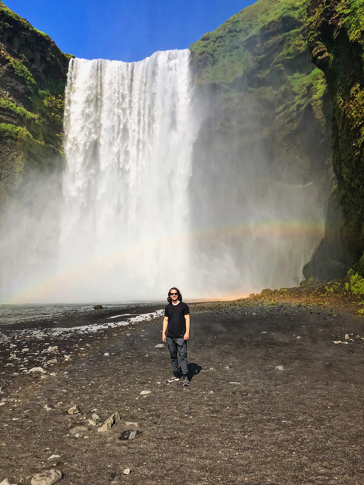

## About me

Hi there! My name is Stephen Powers, and I am a graduate student at Columbia University studying Epidemiology. I am currently a data analyst at the Columbia University [Aging Center](https://aging.columbia.edu) under [Dr. Dan Belsky](https://aging.columbia.edu/about/people/Belsky). Additionally, I am working as a project cordinator for [Hitlab](https://www.hitlab.org/) in New York City. During summer 2019, I traveled to Ireland and Iceland. Below is an image of me next to a waterfall in Iceland called "Skógafoss." 

